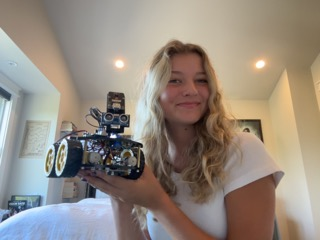
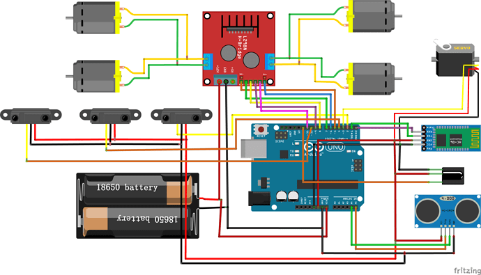

# Line Tracking and Distance Detection Car
Line tracking and distance detection come as first nature to people, but technology does it better, as with most things. I built a line-tracking and distance-detecting robot. The goal: have a robot that moves along a line and then follows an object to hop back on a different set of tracks. I am happy to report I did just that.

| **Engineer** | **School** | **Area of Interest** | **Grade** |
|:--:|:--:|:--:|:--:|
| Macy D. | Los Gatos High School | Mechanical Engineering | Incoming Senior



# Final Thoughts and Demo

My bot operates with four motors in the bottom half of the build connected to an Arduino Uno board with the TB6612FNG, which is the motor driver. Also connected to this board are the sensors on the bottom of the build that detect light on either side of the bot and influence the direction, and the HC-SRO4 ultrasonic sensor, which uses sound to give me a distance output, using a process similar to echolocation. I used all three of these to get my bot to do what you saw before by writing my own code in Arduino for the first time using functions like maps, if statements, and arrays. I did have issues with the motor control, as it tended to want to keep going until it hit a wall. 
I was a complete beginner at coding when I started this program. I had to write my own code for the first time. Even the most basic of commands was a challenge until I fully grasped how to use different functions to get my bot to do incredible things. I entered this program with my heart set on Mechanical Engineering, where only basic coding skills are needed. That is why I picked the RC car. Little did I know the amount of coding that was ahead. After working in Arduino for three weeks, I can honestly say that coding is not as daunting as it once was, and I might have to rethink my aspirations. Honesty, it is safe to say I actually enjoy the practice. A conclusion I never thought I would reach.

<iframe width="560" height="315" src="https://www.youtube.com/embed/Txxft0PYY0I" title="YouTube video player" frameborder="0" allow="accelerometer; autoplay; clipboard-write; encrypted-media; gyroscope; picture-in-picture; web-share" allowfullscreen></iframe>

# Final Milestone 

<!-- **Don't forget to replace the text below with the embedding for your milestone video. Go to Youtube, click Share -> Embed, and copy and paste the code to replace what's below.**

<iframe width="560" height="315" src="https://www.youtube.com/embed/F7M7imOVGug" title="YouTube video player" frameborder="0" allow="accelerometer; autoplay; clipboard-write; encrypted-media; gyroscope; picture-in-picture; web-share" allowfullscreen></iframe> -->

For this milestone, I tackled a lot. I first tested the ultrasonic sensor by running a distance test then from there, I figured out how to work the servo motor to swivel the sensor. Using an array, the sensor told me distance readings every ten degrees in cm. I then ensured it could analyze the shortest output, then turned the servo motor to it. From there, I added the motors in to have the whole car turn to the shortest angle. This posed a unique challenge because initially, the car was turning in the right direction but not stopping at the correct angle. This is when I learned about maps and how to use them to do just that. A map is like a translator that helps you convert one range of values into another field. I found I had to use two maps to get the bot to turn in the right direction with the right angle; from there, I had to add the forward function, and my robot would go in the direction of the shortest distance. From there, I combined the line tracking and the sensor movement to create a bot that can hop back on a line after it gets off. I changed the distance readings to every 5 degrees to make it more accurate, as it would sometimes just miss the line. I accomplished my final goal of the build, line tracking, and distance detection combined. 

# Second Milestone

<iframe width="560" height="315" src="https://www.youtube.com/embed/a9T-wzgI77I" title="YouTube video player" frameborder="0" allow="accelerometer; autoplay; clipboard-write; encrypted-media; gyroscope; picture-in-picture; web-share" allowfullscreen></iframe>

The second milestone, for me, consisted of learning how to write my own code. I used the code from the blink test and an "if" statement to make the LED blink when on a dark surface with the line track bottom sensor. All concepts I used were utterly foreign to me before this milestone. Then I combined the ideas from the motor test run, a sample from a follow-line test, and the sensor run to try and make the robot move on the line. I had trouble getting the bot to follow along sharp curves once I got it to follow the initial semi-straight line. For a while, it only went one way, but then I found out that by using multiple if statements with the combination of the left and right sensors, it could turn back once off the line. As was the initial issue, I had to ensure that once off the line, the car would turn instead of head straight forward. I then created a looped track, and the bot successfully followed the black line in both directions. 


# First Milestone

<iframe width="560" height="315" src="https://www.youtube.com/embed/dDlCzctv_jg" title="YouTube video player" frameborder="0" allow="accelerometer; autoplay; clipboard-write; encrypted-media; gyroscope; picture-in-picture; web-share" allowfullscreen></iframe>

My first milestone was assembling my build and running test code to ensure the motors ran. I ran into a few issues with the TB6612 motor driver. After a few tries, I could upload the code after switching from cam mode to upload mode on my Arduino uno board. The bot moves forward, backward, then side to side after running the motor test run in the SparkFun TB6612FNG Motor Drive Library. 

# Schematics


# Code

```c++
#include <SimpleUltrasonic.h>
#include <Servo.h>
#include <SparkFun_TB6612.h>

#define AIN1 7
#define BIN1 8
#define AIN2 1
#define BIN2 2
#define PWMA 5
#define PWMB 6
#define STBY 3
#define R_S A0 //ir sensor Right
#define L_S A2 //ir sensor Left
#define M_S A1 //ir senoe middle
const int offsetA = 1;
const int offsetB = 1;
Motor motor1 = Motor(BIN1, BIN2, PWMB, offsetB, STBY);
Motor motor2 = Motor(AIN1, AIN2, PWMA, offsetA, STBY);
const int lineTrack = A0;

Servo servo;    
const int trigPin = 13;
const int echoPin = 12;  
const int servoPin = 10;

SimpleUltrasonic sensor(trigPin, echoPin);

int scanAngle = 0;              // Initial servo scanning angle
int pos = 0;

const int minServoAngle = 0;    // Minimum angle of the servo
const int maxServoAngle = 180;  // Maximum angle of the servo
const int maxTurnTime = 1460;   // Time (in milliseconds) to turn 90 degrees


void setup() {
  Serial.begin(9600);
  pinMode(lineTrack, INPUT);
  servo.attach(servoPin);       // Attach servo to the servo pin
  servo.write(scanAngle);       // Set servo to initial angle
  pinMode(trigPin, OUTPUT);
  pinMode(echoPin, INPUT);
  delay(1000);
}

void loop() {                         
  int sensorValue = analogRead(A1);
  int speed = 120;     
  int shortestDistance = 9999;
  int shortestAngle = 0;
  int distance = sensor.measureDistanceInCM();
  
  Serial.println(sensorValue);                           //when the sensor output is above 600 then it is on the line
  if((analogRead(R_S) > 600)&&(analogRead(L_S) > 600)){  //this was for when the track was wide enough to reach both sides, not always in use
    forward(motor1, motor2, 100);}
  if(analogRead(M_S) > 600){                             //"<" = off the line, ">" = on the line
    forward(motor1, motor2, 100);}                                                                              
  if((analogRead(R_S) < 600)&&(analogRead(L_S) > 600)){  //if off track on the right it will trun twards the left
    left(motor1, motor2, 100);}
  if((analogRead(R_S) > 600)&&(analogRead(L_S) < 600)){
    right(motor1, motor2, 100);}
  if((analogRead(M_S) < 600)&&(analogRead(R_S) < 600)&&(analogRead(L_S) < 600)){    //just in case it gets off track
      brake(motor1, motor2);
      for (int angle = 0; angle <= 180; angle += 10) {  // Scan every 10 degrees withing 180 degrees
        servo.write(angle);
        delay(500); 

        distance = sensor.measureDistanceInCM();
     
        Serial.print("Angle: ");
        Serial.print(angle);
        Serial.print(" degrees, Distance: ");
        Serial.print(distance);
        Serial.println(" cm");
                                                           // Check if this distance is shorter than the previous shortest distance
     if (distance != -1 && distance < shortestDistance) {   // check if -1, becuase that is an invalid reading, will not include as shortest
      shortestDistance = distance;                         // then it becomes shortest distance 
      shortestAngle = angle;                               // and shortest angle
    }    
    if (analogRead(M_S) >= 600 || analogRead(R_S) >= 600 || analogRead(L_S) >= 600) {
        break;
    }
    }
     servo.write(shortestAngle);          // Turn the servo head towards the shortest distance, defined above
     Serial.print("Shortest distance: "); // Print the shortest distance
     Serial.print(shortestDistance);
     Serial.println(" cm");
    
     int mappedLeftTurnTime = map(abs(shortestAngle - 90), 0, 90, 1460, 0);
     int mappedRightTurnTime = map(abs(90 - shortestAngle ), 0, 90, 0, 1460);
    
     if (shortestAngle < 90){              // if the shortest angle is < 90 then it will turn towards the right 
       right(motor1, motor2, 100);
       delay(mappedRightTurnTime);
       } else if (shortestAngle > 90) {
         left(motor1, motor2, 100);
         delay(mappedLeftTurnTime);
       } else {
         forward(motor1, motor2, 100);       // If the shortest angle is exactly 90 degrees, go straight
         delay(500);
      }                                   
     forward(motor1, motor2, 100);
     delay(500);
     brake();                                 // Stop both motors
     delay(2000);                           
  }
  } 
void brake() {
  motor1.brake();
  motor2.brake();
  }  
```

# Bill of Materials 

| **Part** | **Note** | **Price** | **Link** |
|:--:|:--:|:--:|:--:|
| Smart Robot Car V4.0 | Main Build | $79.99 | <a href="https://www.amazon.com/ELEGOO-Tracking-Ultrasonic-Intelligent-Educational/dp/B07KPZ8RSZ"> Link </a> |

# Other Resources/Examples
- [Sparkfun Library](https://github.com/sparkfun/SparkFun_TB6612FNG_Arduino_Library)
- [Simple Ultrasonic](https://github.com/gamegine/HCSR04-ultrasonic-sensor-lib)
- [Line Following Example Code](https://circuitdigest.com/microcontroller-projects/arduino-uno-line-follower-robot)
- [Sun Founder](https://docs.sunfounder.com/projects/sensorkit-v2-arduino/en/latest/lesson_35.html)
